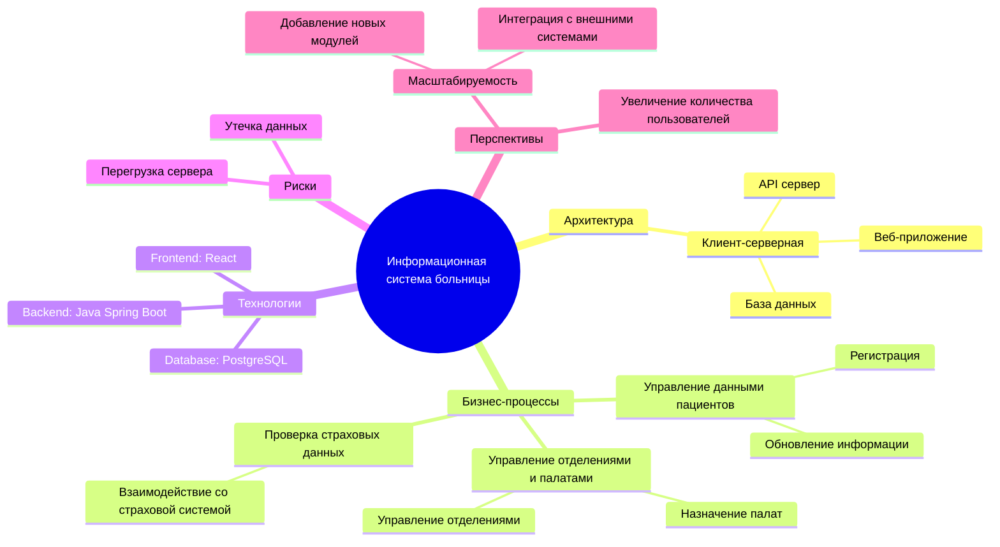
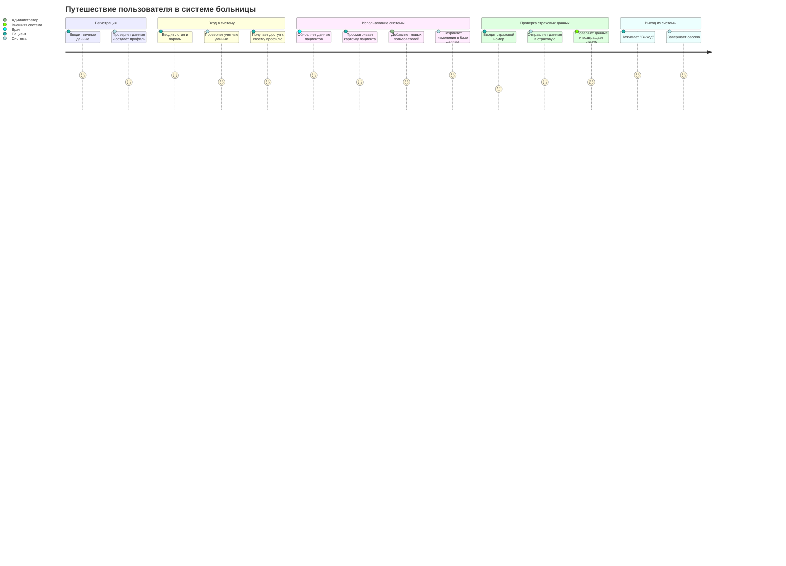
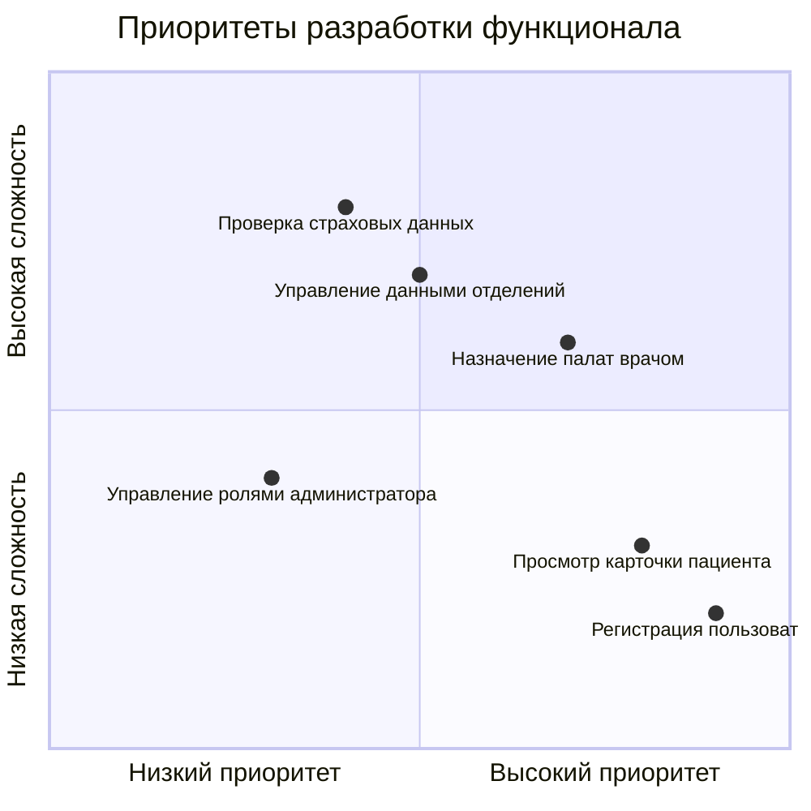
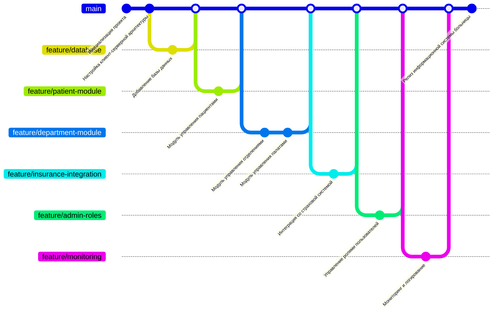

# Проект: Информационная система больницы

Добро пожаловать в репозиторий **Информационной системы больницы**, предназначенной для автоматизации процессов управления пациентами, отделениями и страховыми данными. Система предоставляет функционал для врачей, пациентов и администраторов, обеспечивая эффективное взаимодействие между пользователями и внешними системами.

Проект разработан с использованием клиент-серверной архитектуры, включает в себя ключевые модули управления и аналитики, а также поддерживает масштабируемость и интеграцию с внешними сервисами.

---

## Оглавление
[Описание диаграмм](#описание-диаграмм)  
   - [Mindmap (Карты мыслей)](#mindmap-карты-мыслей)  
   - [Journey Diagram: Путь пользователя](#journey-diagram-путь-пользователя)  
   - [Quadrant Chart: Приоритеты разработки](#quadrant-chart-приоритеты-разработки)  
   - [GitGraph: История коммитов](#gitgraph-история-коммитов)  

---

## Описание диаграмм

### 1. **Mindmap (Карты мыслей): Функциональные возможности**

---

### 2. **Journey Diagram: Путь пользователя**

---

### 3. **Quadrant Chart: Приоритеты разработки**

---

### 4. **GitGraph: История коммитов**

---

## Ветки и их описание

### **feature/database**
Реализация структуры базы данных для хранения информации о пациентах, палатах и отделениях.  
Ключевые коммиты:
- **Добавление базы данных**: Настройка и инициализация PostgreSQL.

### **feature/patient-module**
Функционал для управления данными пациентов.  
Ключевые коммиты:
- **Модуль управления пациентами**: Регистрация и обновление данных пациентов.

### **feature/department-module**
Функционал для управления отделениями и палатами.  
Ключевые коммиты:
- **Модуль управления отделениями**: Добавление логики управления отделениями.
- **Модуль управления палатами**: Назначение палат пациентам.

### **feature/insurance-integration**
Интеграция со страховой системой для проверки страховых данных пациентов.  
Ключевые коммиты:
- **Интеграция со страховой системой**: Взаимодействие через API.

### **feature/admin-roles**
Реализация управления ролями пользователей (врач, администратор, пациент).  
Ключевые коммиты:
- **Управление ролями пользователей**: Добавление разграничения доступа.

### **feature/monitoring**
Добавление мониторинга и логирования.  
Ключевые коммиты:
- **Мониторинг и логирование**: Настройка инструментов для отслеживания состояния системы.

---

## Заключение

Информационная система больницы позволяет автоматизировать управление данными пациентов, палат и отделений, а также взаимодействовать со страховыми системами. С помощью **диаграмм Mindmap**, **Journey**, **Quadrant Chart** и **GitGraph** проект был структурирован и детально описан. Каждая ветка разработки решала конкретные задачи, а финальный релиз представляет готовую к эксплуатации систему, ориентированную на эффективность, безопасность и масштабируемость.
